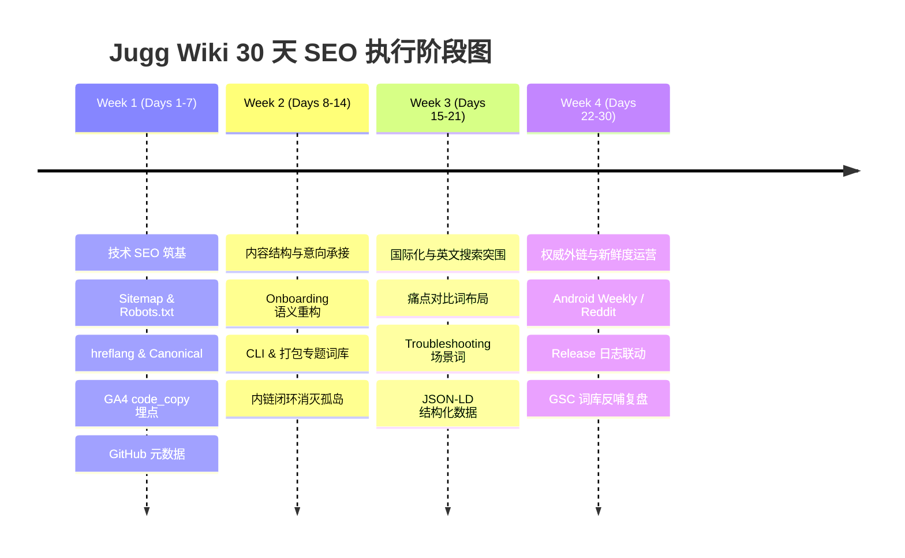

# Jugg Wiki 30 天 SEO 执行计划

> 创建时间：2026-09-18  
> 状态：进行中（阶段一执行中）

---

## 1. 背景与现状诊断

基于 2026-09-18 的《Jugg Wiki SEO 现状简报》：
* **核心表现数据 (Sep 12 - Sep 17)**：
  - 活跃用户：435 人；会话数：606 次。
  - 整体参与率：28.7%（明显低于技术文档类行业中位数 46-48%）。
  - 地域分布：集中在亚太地区（中国 CN 216人、新加坡 SG 155人、美国 US 33人）。
* **流量结构**：
  - Direct 71.5%、Referral 26%、Organic Search < 1%。
  - 自然搜索曝光度接近于零，高度依赖直接访问与社交传播（企业微信/飞书/微信群/GitHub）。
* **内容表现**：
  - 最热门入口为“快速开始” (`/onboarding` 与 `/zh/onboarding`，最主要着陆页 73 次会话）。
  - 核心兴趣点聚集在：插件安装、CLI 命令行使用、支持打包方式（增量编译、混淆、AabResGuard 等）。
* **核心技术缺失**：
  - VitePress 缺少 `sitemap.xml` 自动生成。
  - 缺少 `robots.txt`、Canonical 规范链接与 hreflang 语言标记。
  - 缺少 Google Search Console (GSC) 与 Bing Webmaster 站点地图提交与验证。
  - 缺少 OpenGraph / Twitter Card 社交分享元数据。
  - 缺少 `code_copy` 与外部转化漏斗的事件埋点。

---

## 2. 30 天目标与衡量指标 (KPIs)

| 维度 | 当前基线 | 30 天目标 | 衡量方式 |
|---|---|---|---|
| 自然搜索流量占比 | < 1% | >= 8% - 10% | GA4 Traffic Acquisition (Organic Search) |
| 全站参与率 (Engagement Rate) | 28.7% | >= 40% | GA4 Engagement Overview |
| 非中文地区月会话 (US/SG/EU) | ~188 | 增长 50%+ | GA4 Demographics |
| Google 索引页面数 | 极少 / 未提交 | 100% 覆盖非 dev 页面 | GSC Coverage / Pages Indexed |
| 代码复制转化 (code_copy) | 0 (未追踪) | 建立基线并周环比增长 | GA4 Custom Event: `code_copy` |

---

## 3. 四阶段详细执行路线

---

### 阶段一：技术 SEO 筑基与爬虫打通（Days 1 – 7）
* **目标**：建立搜索引擎基础设施，让 Google/Bing 48 小时内快速索引全站，打通权重传递，建立交互转化埋点。
* **主要任务**：
  1. **VitePress Sitemap 与 Robots.txt**：
     - 在 `docs/wiki/.vitepress/config.mts` 中开启 VitePress 内置 `sitemap` 配置，指向 GitHub Pages 官方域名。
     - 补齐 `docs/wiki/public/robots.txt`，声明允许爬取路径与 sitemap 位置，排除 dev 页面。
  2. **Canonical 与 hreflang 注入**：
     - 在 VitePress 中注入 `transformHead`，为每个页面自动补齐规范 canonical 链接以及中英文 `alternate hreflang` 标记，避免多语言内容被判定重复。
     - 注入 OpenGraph (`og:title`, `og:description`, `og:site_name`, `og:url`) 元标签。
  3. **GA4 事件增强 (`code_copy`)**：
     - 在 `docs/wiki/.vitepress/theme/index.ts` 监听代码块复制事件，上报 `code_copy` 到 GA4，统计代码样例实际调用转化。
  4. **GitHub 仓库元数据优化**：
     - 优化 GitHub 仓库 About、Topics 和 README 关键词（包括 `incremental-compilation`, `fast-build`, `android-studio-plugin`, `hot-reload` 等）。
  5. **站长工具收录与验证**：
     - 指引并配置 GSC 与 Bing Webmaster 站点验证，主动提交 `sitemap.xml`。

---

### 阶段二：高意向页面语义化与内链重构（Days 8 – 14）
* **目标**：聚焦高频入口（快速开始、安装、CLI、打包机制），重构内容层次，消除孤立页面，拉升参与率至 40%。
* **主要任务**：
  1. **热门着陆页（Onboarding）重构**：
     - 规范 H1~H3 语义化层级，将“步骤一”等抽象命名改为带有搜索意图的具体标题。
     - 首屏增加“30 秒快速体验”互动代码块与可视化动图，降低跳出率。
  2. **高意向关注点长尾词布局**：
     - CLI 页面（`/guide/cli`）补充子命令实战速查表与常见使用场景。
     - 打包兼容专题（`/concepts/incremental-compile/` 与 `/troubleshooting/supported-packaging`）强化 AabResGuard、Dynamic Feature、Release 混淆增量构建、系统应用自定义安装/签名脚本等关键词覆盖。
  3. **内链闭环建设**：
     - 梳理孤立页面，在各概念与排查篇末尾增设“下一步指引 (Next Steps)”卡片，加强 Guide 与 Concepts 的相互跳转。

---

### 阶段三：国际化破局与英文搜索排名冲刺（Days 15 – 21）
* **目标**：突破欧美与非中文地区曝光壁垒，精准狙击海外 Android 开发者的真实搜索痛点。
* **主要任务**：
  1. **英文痛点词靶向布局**：
     - 针对 `Speed up Android Studio build time`、`Android bypass Gradle build`、`Android hot reload without Gradle modification` 等词汇，重构英文首页 `/` 与核心介绍页。
  2. **常见错误与 Troubleshooting 长尾词库**：
     - 将常见编译报错、兼容性场景（如 Kotlin IR lowering、D8 dex merge、多模块依赖常量变更）制作成问答式 FAQ，承接搜索引擎的长尾精准流量。
  3. **Schema 结构化数据 (JSON-LD)**：
     - 针对软件与技术文档注入 `SoftwareApplication` 和 `TechArticle` schema，争取 Google 搜索富媒体结果（Rich Snippets）曝光。

---

### 阶段四：权威外链建设、抓取新鲜度与数据复盘（Days 22 – 30）
* **目标**：获取外部权威推荐外链，保持文档高频抓取，结合 GSC 初步搜索数据反哺关键词。
* **主要任务**：
  1. **全球 Android 开发者生态外链拓展**：
     - 向 Android Weekly、Kotlin Weekly 投稿；在 Reddit (r/androiddev) 和 Medium/Dev.to 发起技术深度探讨。
  2. **利用新鲜度 (Freshness) 机制加速抓取**：
     - 将 Release Notes 与 Wiki Changelog 联动，每次版本迭代同步更新对应页面，保持爬虫高频回访。
  3. **Day 30 全盘复盘与调优**：
     - 导出 GSC 28 天表现数据，筛选排名前 20 但 CTR 较低的长尾词，做针对性标题和摘要二次优化。
     - 对比 GA4 参与率与渠道结构变化，制定 Q4 持续增长策略。
